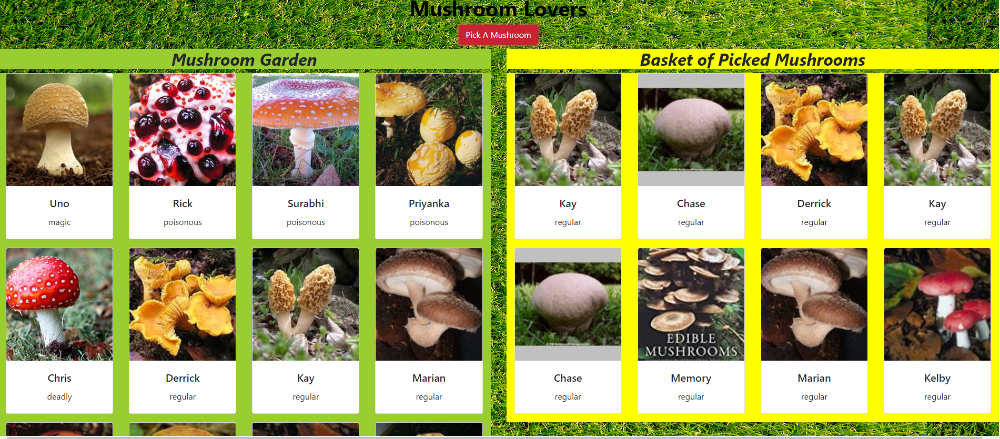

# Mushroom Picker

## Description
This project showcases the use of react and using the features of State, Props, and Render.
### Feature List
- Mushroom Garden
- Mushroom Basket
 

## Screenshots
### Mushroom Garden and Mushroom Basket

 ## How to Run
1. Clone down this repo
1. Make sure you have http-server installed via npm. If not get it [HERE](https://www.npmjs.com/package/http-server).
1. On your command line run `hs -p 9999`
1. In your browser go to `http://localhost:9999`

## Contributors
[Monique Bass](https://github.com/Nikababy01)
